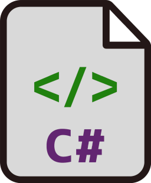

# CsCodeExample
Examples of c# code in form of a simple tutorial.
Containing:
- Console Output
- Variables
- Declaration
- Arithmetic Operators
- Selection Statements
- Iteration Statements
- Arrays and Lists
- Parsing and Exceptions
- Functions
- Enum
- Classes
- Console Input
- File Read & Write

Logo:   

[](https://github.com/borisdj/CsCodeGenerator/blob/master/LICENSE)  

## Support
If you find this project useful you can mark it by leaving a Github **Star** :star:  
And even with community license, if you want help development, you can make a DONATION:  
[](https://www.buymeacoffee.com/boris.dj) _ or _ 
[:zap:](https://borisdj.net/donation/donate-btc.html)    

## Contributing
Please read [CONTRIBUTING](CONTRIBUTING.md) for details on code of conduct, and the process for submitting pull requests.  
When opening issues do write detailed explanation of the problem or feature with reproducible example.  
Want to **Contact** for Development & Consulting: [www.codis.tech](http://www.codis.tech) (*Quality Assurance*)  

**Also take a look into others packages:</br>
Open source (MIT or cFOSS) authored [.Net libraries](https://infopedia.io/dot-net-libraries/) (@**Infopedia.io** personal blog post)
| №  | .Net library             | Description                                              |
| -  | ------------------------ | -------------------------------------------------------- |
| 1  | [EFCore.BulkExtensions](https://github.com/borisdj/EFCore.BulkExtensions) | EF Core Bulk CRUD Ops (**Flagship** Lib) |
| 2  | [EFCore.UtilExtensions](https://github.com/borisdj/EFCore.UtilExtensions) | EF Core Custom Annotations and AuditInfo |
| 3  | [EFCore.FluentApiToAnnotation](https://github.com/borisdj/EFCore.FluentApiToAnnotation) | Converting FluentApi configuration to Annotations |
| 4  | [FixedWidthParserWriter](https://github.com/borisdj/FixedWidthParserWriter) | Reading & Writing fixed-width/flat data files |
| 5  | [CsCodeGenerator](https://github.com/borisdj/CsCodeGenerator) | C# code generation based on Classes and elements |
| 6* |  [CsCodeExample](https://github.com/borisdj/CsCodeExample) | Examples of C# code in form of a simple tutorial |

# Naming Conventions
Local variables - nonCapitalLetter, camelCase.  
Class, Function (Method - in a class) and Property name - CapitalLetter, PascalCase.  
DO choose easy readable identifier (eg. HorizontalAlignment more English-readable than AlignmentHorizontal).  
DO favor readability over brevity (property CanScrollHorizontally better than ScrollableX (obscure X-axis ref).  
DO NOT use underscores (Hungarian notation), hyphens, or any other nonalphanumeric characters.  
AVOID using identifiers that conflict with keywords of widely used programming languages.  

# Programming Principles:
**DRY** - Don't Repeat Yourself  
**YAGNI** - You Aren't Gonna Need It (but have as much as you can out of the box)  
**KISS** - Keep it Simple, Stupid - [Kelly Johnson](https://en.wikipedia.org/wiki/Kelly_Johnson (engineer))  
	"*Good design is as little design as possible.*" - Dieter Rams  
	"*Everything should be made as simple as possible, but not simpler.*" - Albert Einstein  
	"*Complexity is your enemy. Any fool can make something complicated. It's hard to keep things simple.*"-Richard Branson  
	"*Simple can be harder than complex: You have to work hard to get your thinking clean to make it simple.*" - Steve Jobs  
	"*I have made this letter longer than usual, only because I have not had the time to make it shorter.*" - Blaise Pascal  
	"*I have just three things to teach: simplicity, patience, compassion. These three are your greatest treasures.*" - Lao Tzu  

**LoD**   - Law of Demeter or principle of least knowledge  
**SoC**   - Separation of Concerns; Layers: presentation, business(service), DAL - data access layer, DB - database  
**DDD**   - Domain Driven Design  
 _ **RP** - Repository Pattern [msdn/TheRepoPattern](https://msdn.microsoft.com/en-us/library/ff649690.aspx) (allows dependency injection and unit test for EF)  
 _ **DI** - Dependecy Injection (**IoC** - Inversion of Control), loosely-coupled  
**PRG** pattern - Post/Redirect/Get  
**GRASP** - General Responsibility Assignment Software Patterns  

**OOP** - Object Oriented Programming  
**SOLID** (object-oriented design) [SolidInPictures](https://lostechies.com/derickbailey/2009/02/11/solid-development-principles-in-motivational-pictures/):  
[S] SRP - Single Responsibility Principle (a class should have only a single responsibility)  
[O] OCP - Open/Closed Principle (entities[class, function,..] to be open for extension, closed for modification)  
[L] LSP - Liskov Substitution Principle (objects replaceable with subtypes instances without altering correctness)  
[I] ISP - Interface Segregation Principle (many client-specific interfaces are better than one general-purpose interface)  
[D] DIP - Dependency Inversion Principle (Depend upon abstractions, not upon concretions, Dependency injection)  

**CODE:**
```C#
// - LINE COMMENT

/*
SEGMENT COMMENT
*/

// break point(F5, F10), refactor, search and replace, Go to def., Find all ref., (un)comment

#region MyRegion
// your collapsible code here
#endregion

#region Output
Console.Write("OUTPUT:");
Console.WriteLine("Program is running.");

Console.WriteLine();
#endregion

#region Variables
// VARIABLES (local - must be assigned)
// primitive(built in) type / object (value range)
/*
bool    / Boolean   (true, false)                   [default: false]
byte    / Int8      (+- 127)                        [default: 0]
short   / Int16     (+- 32,767)                     [default: 0]
int     / Int32     (+- 2,147,483,647)              [default: 0]
long    / Int64     (+- 9,223,372,036,854,775,807)  [default: 0]
float               (+- 1.5 E−45 to +- 3.40282347 E+38)            [default: 0]  Precision: ~6-9 digits
double              (+- 5.0 E−324 to +- 1.7976931348623157 E+308)  [default: 0]  Precision: ~15-17 digits
decimal / Decimal   (+- 1.0 E-28 to +- 7.9228 E28)                 [default: 0]  Precision: 28-29 digits
char    / Char                                      [default: '']
string  / String                                    [default: null, nullable]
var // can be any type
*/
#endregion

#region Naming Conventions
/*
local variables - nonCapitalLetter, camelCase
Class, Function(Method - in a class) and Property name - CapitalLetter, PascalCase
DO choose easily readable identifier names(exmample HorizontalAlignment more English-readable than AlignmentHorizontal)
DO favor readability over brevity.
The property name CanScrollHorizontally is better than ScrollableX (an obscure reference to the X-axis).
DO NOT use underscores(Hungarian notation), hyphens, or any other nonalphanumeric characters.
AVOID using identifiers that conflict with keywords of widely used programming languages.
*/
#endregion

#region Declaration
// Declaration of variable (camelCase Notation)
bool isAdmin;
int counter;
double sum;
decimal number;
char character;
string name;

// Assignment of variable
isAdmin = true;
counter = 5;
sum = 3.14;
number = 18.65m;
character = 'a';

name = "Ben Benito";

Console.WriteLine("c" + counter);

// Declaration and Assignment
bool isActive = true;

// Nullable (can take all values of its underlying value type and an additional null value)
bool? isEnded = null;
string city = null;
// String is null (and therefore nullable) by default, so there's no need for this notation)

// Cast
int inputAmount = 126;
decimal secondAmount = inputAmount; // implicit cast
int thirdAmount = (int)secondAmount; // explicit cast
string strNum = "1234";
int outputNum = int.Parse(strNum);

Console.WriteLine("DECLARATION");
Console.WriteLine("T or F: " + isAdmin);
Console.WriteLine("Counter: " + counter);
Console.WriteLine("Sum: " + sum);
Console.WriteLine("Number: " + number);
Console.WriteLine("Letter: " + character);
Console.WriteLine("Word or Sentance: " + name);
Console.WriteLine("Active: " + isActive);
Console.WriteLine("Finished: " + isEnded);

// string interpolation
Console.WriteLine("City Name: " + city); // Old way to concatenate strings
Console.WriteLine("City Name: {0}", city);
Console.WriteLine($"City Name: {city}"); // Newest way, from C# 6 version

Console.WriteLine();
#endregion

#region Operators
// Arithmetic Operators
// = + - * / %
int x = 10, y = 6; // Declaration and assignment of multiple variables of the same type at once
int result = x + y;

Console.WriteLine("OPERATORS");
Console.WriteLine("a + b = " + x + " + " + y + " = " + result);
Console.WriteLine("a + b = {0} + {1} = {2}", x, y, result);
Console.WriteLine($"a + b = {x} + {y} = {result}");

x *= 2;
//x = x * 2;

x++;
//x = x + 1;

//x--;
//x = x - 1;

Console.WriteLine("x = x * 2 + 1 = " + x);
Console.WriteLine("r = x++ = " + x++); // output is the value of x BEFORE incrementing
Console.WriteLine("x= " + x);
Console.WriteLine("r = ++x = " + ++x); // output is the value of x AFTER incrementing
Console.WriteLine("x = " + x);
Console.WriteLine("");

// Relation Operators
// == !=  > >= < <=

// Logical Operators
// && AND
// || OR
// !  NOT
#endregion

#region Selection Statements (Conditionals)
Console.WriteLine("SELECTION STATEMENTS (Conditionals)");
// if, else, switch, case

bool print = true;

if (print)
	Console.WriteLine("true - ");

print = false;

if (print)
	Console.WriteLine("false - no output");

if (!print)
	Console.WriteLine("not false = true - output");

int age = 20;
if (age > 18)
	Console.WriteLine("Adult");
else
	Console.WriteLine("Minor");

int value = 23; // value range 0-29
string clause = "Value is from-to: ";

if (value >= 0 && value < 10)
	Console.WriteLine(clause + "0-9");
else if (value >= 10 && value < 20)
	Console.WriteLine(clause + "10-19");
else if (value >= 20 && value < 30)
	Console.WriteLine(clause + "20-29");
else
	Console.WriteLine(clause + "30+");


int mod = value % 3;

if (mod == 1)
	Console.WriteLine("Remainder 1");
else if (mod == 2)
	Console.WriteLine("Remainder 2");
else
	Console.WriteLine("Divisible with 3");

switch (mod)
{
	case 1:
		Console.WriteLine("Remainder 1");
		break;
	case 2:
		Console.WriteLine("Remainder 2");
		break;
	default:
		Console.WriteLine("Divisible with 3");
		break;
}

int? year = null;
// null coalescing operator (??) - returns the value of its left-hand operand if it isn't null; otherwise, it evaluates the right-hand operand and returns its result
Console.WriteLine("Year = " + (year ?? 2017)); // returns 2017, as year == null

string yearType = year % 2 == 0 ? "Even year" : "Odd year"; // (? :) - conditional operator, ternary
// General case:  result = condition ? result if condition is true : result if condition is false;
Console.WriteLine("Year type :" + yearType);

#endregion

#region Iteration Statements
Console.WriteLine("ITERATION STATEMENTS");
// for, while, do, foreach, in

// Jump statements
// break, continue, default, return, (go to)

// Exception handling statements
// throw, try-catch


Console.Write("For loop: ");

for (int i = 1; i <= 5; i++)
	Console.Write(i + " ");

Console.WriteLine("");
Console.Write("While a): ");
// Do - while loop, executes at least once, even if the condition is not fulfilled
int k = 40;
do
{
	k = k * 2;
	Console.Write(k + " ");
} while (k < 20);

Console.WriteLine("");
Console.Write("While b): ");
k = 1;
while (k < 20)
{
	k = k * 2;
	if (k == 8)
		break;
	Console.Write(k + " ");
}

Console.WriteLine("");
Console.Write("While c): ");
k = 1;
while (k < 20)
{
	k = k * 2;
	if (k == 8)
		continue;
	Console.Write(k + " ");
}

Console.Write("\n\n");
#endregion

#region Arrays
Console.WriteLine("ARRAYS");

double[] fiveDayPrices = new double[5]; // fixed size;
fiveDayPrices[0] = 3.45;
fiveDayPrices[1] = 3.55;
fiveDayPrices[2] = 3.58;
fiveDayPrices[3] = 3.30;
fiveDayPrices[4] = 3.32;

Console.Write("Five day prices: ");
for (int i = 0; i < 5; i++)
{
	Console.Write(fiveDayPrices[i] + " ");
}

Console.Write("\nFive day prices backwards: ");
for (int i = fiveDayPrices.Length - 1; i >= 0; i--)
{
	Console.Write(fiveDayPrices[i] + " ");
}

Console.Write("\nForeach: ");
foreach (var element in fiveDayPrices)
{
	Console.Write(element + " ");
}

Console.WriteLine("");

Console.WriteLine("Matrix");
// Multidimensional arrays
// Two-dimensional array. 
int[,] matrix = new int[3, 3]; // fixed size;

matrix[0, 0] = 1;
matrix[0, 1] = 2;
matrix[0, 2] = 3;
matrix[1, 0] = 4;
matrix[1, 1] = 5;
matrix[1, 2] = 6;
matrix[2, 0] = 7;
matrix[2, 1] = 8;
matrix[2, 2] = 9;

for (int i = 0; i < 3; i++)
	for (int j = 0; j < 3; j++)
		Console.Write(matrix[i, j] + " ");

Console.WriteLine();

int[,] matrixB = new int[3, 3]; // fixed size;

for (int i = 0; i < 3; i++)
{
	for (int j = 0; j < 3; j++)
	{
		matrixB[i, j] = (i * 3) + j + 1;
		Console.Write(matrixB[i, j] + " ");
		if ((j + 1) % 3 == 0)
			Console.WriteLine("");
	}
}

// A similar array with string elements. 
string[,] array2Db = new string[3, 2] { { "one", "two" }, { "three", "four" }, { "five", "six" } };

// Three-dimensional array. 
int[,,] array3D = new int[,,] { { { 1, 2, 3 }, { 4, 5, 6 } }, { { 7, 8, 9 }, { 10, 11, 12 } } };


Console.WriteLine("Dif. Matrix");
// Array(Jagged) that can have different row size

// This could be clarified!
int[][] jaggedArray = new int[3][];
for (int i = 0; i < 3; i++)
{
	jaggedArray[i] = new int[(i + 1)];
	for (int j = 0; j < (i + 1); j++)
	{
		jaggedArray[i] = new int[(i + 1)];
		jaggedArray[i][j] = (i * 3) + j + 1;
		Console.Write(jaggedArray[i][j] + " ");
		if ((j + 1) % (i + 1) == 0)
			Console.WriteLine("");
	}
}

// List
List<string> words = new List<string>
{
	"one",
	"two",
	"three",
};
words.Add("four");
words.Add("five");
words.Remove("three");

Console.WriteLine("");
foreach (var word in words)
	Console.Write(word + " ");

Console.WriteLine("\n" + words[1]);
Console.WriteLine(words.ElementAt(1));

List<char> letters = new List<char>() { 'a', 'b', 'c' };

foreach (var letter in letters)
{
	Console.Write(letter + " ");
}
// Dictionary
Dictionary<String, int> accounts = new Dictionary<String, int>
{
	{ "Cash", 110 },
	{ "Receivable", 120 },
	{ "Supplies", 130 },
};
accounts.Add("Insurance", 150);

accounts.TryGetValue("Supplies", out int account);

Console.Write("\nSupplies account: " + account);


List<string> sentences = new List<string>
{
	"I am playing",
	"I play",
	"You are going",
	"You go",
	"He is running"
};
sentences.Remove("He runs");

// Lambda expression =>
IEnumerable<string> ingEndSentences = sentences.Where(a => a.EndsWith("ing")); // EndsWith, Contains
List<string> ingEndSentences2 = sentences.Where(a => a.EndsWith("ing")).ToList(); // EndsWith, Contains

Console.WriteLine("\nING:");
foreach (var sentence in ingEndSentences2)
{
	Console.WriteLine(sentence);
}

List<string> ingEndSentences3 = new List<string>();
foreach (var sentence in sentences)
{
	if (sentence.EndsWith("ing"))
	{
		ingEndSentences3.Add(sentence);
	}
}
#endregion

#region Parsing and Exceptions
Console.WriteLine("\n\nPARSING AND EXCEPTIONS");

string customNumStr = "324erer";
int customNum;
var validNum = int.TryParse(customNumStr, out customNum);
if (validNum)
	Console.WriteLine(customNum);
else
	Console.WriteLine("Parse Error");

try
{
	customNum = Int32.Parse(customNumStr);
}
catch (Exception ex)
{
	Console.WriteLine("Exception:\n" + ex.StackTrace + "\n");
	//throw new Exception("Exception on Parsing string to int.");
}
#endregion

#region Methods
Console.WriteLine("\nMETHODS (Functions)");
// Access Modifiers
//   public    - most accessible
//   protected - in class where declared and all derived classes
//   internal  - within files in the same assembly
//   private   - only in class where declared

// Output: return type(one) - [void = no return], side effects

// Input: arguments

// keyword static - can be called without object instantiation

PrintText("To be printed.");
PrintText("End.");

decimal num1 = 12.3m;
decimal num2 = 2.5m;
int num3 = 3;

decimal quotient = Divide(num1, num2); // num1, num2 are Arguments - values on function call
Console.WriteLine("{0} / {1} = {2}", num1, num2, quotient);

Console.WriteLine("{0} * {1} * {2} = {3}", num1, num2, num3, Multiple(num1, num2, num3));
Console.WriteLine("{0} * {1} = {2}", num1, num2, Multiple(num1, num2));
Console.WriteLine("{0} * {0} = {1}", num1, Multiple(num1));

Console.WriteLine("5! = " + Fact(5)); //Recursion
Console.WriteLine("6! = " + Factorial(6));

Console.WriteLine("Log10(136) = " + Math.Log10(136));

#endregion

#region Enum
Console.WriteLine("\nENUM"); // Enumerator

Gender wordGender = Gender.Neutrum;
Gender word2Gender = (Gender)1; // cast

Console.WriteLine("word Gender: " + wordGender);
Console.WriteLine("word2 Gender: " + word2Gender);
if (wordGender == Gender.Neutrum)
{
	Console.WriteLine("word Gender: " + wordGender.ToString());
	Console.WriteLine("word Gender Id: " + (int)wordGender);
}

Sex personSex = Sex.Male;
Console.WriteLine("Sex: " + personSex.ToString());
Console.WriteLine("Sex: " + personSex.GetDescription());

Console.WriteLine("All Genders:");
foreach (Gender gender in Enum.GetValues(typeof(Gender)))
{
	Console.WriteLine("- {0}", gender.GetDescription());
}
#endregion

#region Classes
Console.WriteLine("\nCLASSES");

decimal xReal = 2, xImag = 3;
decimal yReal = 4, yImag = 5;
decimal zReal, zImag;

zReal = Add(xReal, yReal);
zImag = Add(xImag, yImag);

ComplexNumber xComplex = new ComplexNumber(2, 3);
ComplexNumber yComplex = new ComplexNumber(4, 5);
ComplexNumber zComplex = xComplex.Add(yComplex);


// System Class
DateTime currentDate = DateTime.Now;
Console.WriteLine("DateTime.Now() = {0}", currentDate);
Console.WriteLine("Date = {0} ", currentDate.ToString("dd.MM.yyyy"));
Console.WriteLine("Date = {0:dd.MM.yyyy} ", currentDate);
Console.WriteLine("Year = " + currentDate.Year);

// Custom Classes
// ComplexNumber
Console.WriteLine("");
Console.WriteLine(ComplexNumber.Format);
Console.WriteLine(ComplexNumber.GetDescription());

ComplexNumber complex0 = new ComplexNumber();
complex0.Real = 1;

ComplexNumber complex1 = new ComplexNumber(5, 3);
double r = complex1.Real;

ComplexNumber complex2 = new ComplexNumber
{
	Real = 6,
	Imag = 7
};

ComplexNumber complex3;
complex3 = new ComplexNumber()
{
	Real = 4,
	Imag = 2
};

MoreComplexNumber complex4 = new MoreComplexNumber(4, 2);
MoreComplexNumber complex = new MoreComplexNumber();

ComplexNumber summation = complex1.Add(complex2).Add(complex3);
//ComplexNumber summation2 = ComplexNumber.Add(ComplexNumber.Add(complex1, complex2), complex3);

ComplexNumber division = complex1.Divide(complex2);

Console.WriteLine("c0 = " + complex0);
Console.WriteLine("c1 = " + complex1);
Console.WriteLine("c2 = " + complex2.ToString());
Console.WriteLine("c3 = " + complex3.ToDiffString());
Console.WriteLine("c4 = " + complex4.ToDiffString());

Console.WriteLine("\nsummation = " + summation.ToDiffString());
Console.WriteLine("division = " + division.ToDiffString());
Console.WriteLine("minus = " + new ComplexNumber(2, -5).ToDiffString());
Console.WriteLine("real = " + new ComplexNumber(7, 0).ToDiffString());

Console.WriteLine("c1(modul) = " + complex1.Modul());
Console.WriteLine("c1 ^ 0 =" + complex1.Pow(0));
Console.WriteLine("c1 ^ 1 =" + complex1.Pow(1));
Console.WriteLine("c1 ^ 2 =" + complex1.Pow(2));
Console.WriteLine("c1 ^ 4 =" + complex1.Pow(2));
Console.WriteLine("c1 ^ (-2) =" + complex1.Pow(-2));

List<ComplexNumber> roots = complex1.Nroot(3);
Console.WriteLine("c1 ^ (1/3) = ");
foreach (var c in roots)
	Console.WriteLine(c);

// User
User user = new User()
{
	FirstName = "John",
	LastName = "Reacher",
	PersonSex = Sex.Male,
	BirthDate = DateTime.Parse("12/5/1987"),
	UserName = "Johnny",
	Email = "joe@gmail.com",
	Company = "Google",
	YearsOfService = 5,
	Sallary = 2000/*,
	HomeAddress = new Address()
	{
		City = "Banjaluka",
		Street = "Jevrejska"
	}*/
};

user.ResetPassword("1234abc!");

user.HomeAddress = new Address()
{
	City = "London",
	Street = "Baker Street"
};

Console.WriteLine("\nUSER: " + user);
Console.WriteLine("Year of Birth: " + user.BirthDate.Year);
Console.WriteLine("City: " + user.HomeAddress.City);

Square Square = new Square(4);
Console.WriteLine("Square(side:4), area = " + Square.CalcArea());

#endregion

#region InputConsole
Console.WriteLine("INPUT (console)");
string input = null;

while (input != "")
{
	Console.Write("\nInput number:");
	input = Console.ReadLine();
	bool inputValid = int.TryParse(input, out int inputNum);
	if (inputValid)
		Console.WriteLine("Number is valid. (Press Enter to Finish)\n");
	else
		Console.WriteLine("Number is not valid.(Press Enter to Finish)\n");
}
#endregion

#region InputFile
Console.WriteLine("INPUT (file)");
Console.Write("\nInput file path(Enter for no file, 'd' for default[ComplexIn.csv]): ");

string desktop_path = Environment.GetFolderPath(Environment.SpecialFolder.Desktop) + "//";

string filePath = null;
string inputFilePath = Console.ReadLine();
if (inputFilePath == "d")
	inputFilePath = "ComplexIn.csv";
if (inputFilePath != "")
	filePath = desktop_path + inputFilePath;

string output_file = "ComplexOut.csv";
string line = null;
char separator = ',';

List<ComplexNumber> complexNumbers = new List<ComplexNumber>();

if (inputFilePath != "")
	using (StreamReader str_reader = new StreamReader(filePath))
	{
		str_reader.ReadLine(); // skips first line as it contains names of columns
		while ((line = str_reader.ReadLine()) != null)
		{
			string[] values = line.Split(separator);
			complexNumbers.Add(new ComplexNumber(Double.Parse(values[0]), Double.Parse(values[1])));
		}

		//output all objects to the file
		string output_path = Environment.GetFolderPath(Environment.SpecialFolder.Desktop);
		using (StreamWriter wr = new StreamWriter(desktop_path + output_file))
		{
			wr.WriteLine("Real,Imag");
			foreach (var complexNumber in complexNumbers)
				wr.WriteLine(complexNumber.ToCSV());
		}
	}
Console.WriteLine("Press Enter for Quit.");
Console.ReadKey();
// Don't copy code, all that is repeated should be in functions
```
